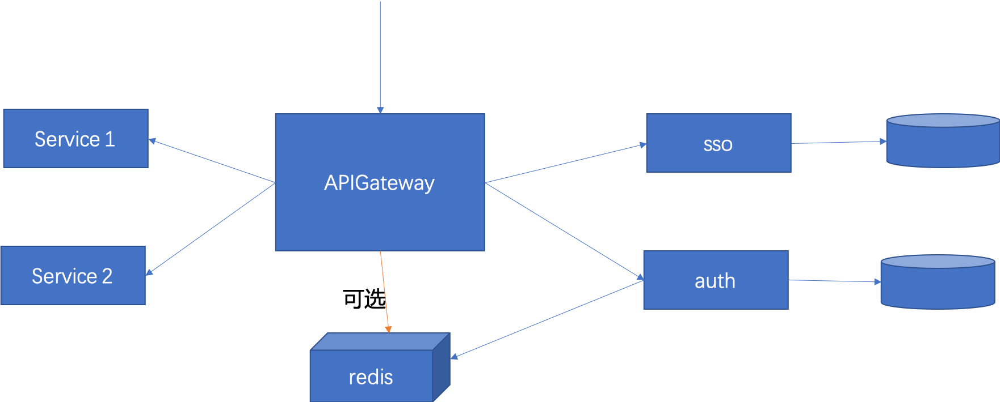

# 微服务架构下登录、认证鉴权服务案例

单点登录实现起来相对简单，而认证、鉴权跟业务联系比较紧密，实际上很难有通用的方案。本文从单体架构开始分析，逐步
说明微服务架构下应该如何建立登录、认证鉴权等服务，代码采用的是方案三，只是一个demo，仅做参考。

首先需要说明的是，在web类应用，或者使用RESTful进行通信的微服务，通常采用过滤器（filter）进行请求过滤，
可以更方便的拿到cookie或者header信息。
验证单点登录，因为拦截器（AOP）拦截的是方法，配置不好的话，容易被拦截多次，而认证鉴权通常采用拦截器实现。
所有的方案都离不开这两种方式。

在spring的体系下，通常使用注解拦截某个方法来配置，也可以直接拦截某个目录来配置。

## 单体架构下的登录、认证鉴权并不适合在微服务架构下使用

在单体架构下，认证、鉴权等框架比较多，目前比较流行的方案是用JWT、shiro或者spring security来搞定，如上图所示，
外部访问Service的时候，通常使用过滤器首先对请求进行过滤，判断header或者cookie中是否带有token，
验证token是否有效，否则重定向到登录页面。

CAS是一个更古老一些的方案，CAS是独立的服务，每次请求都需要到CAS服务进行验证，之前我们曾经开源过一个K4sso，
原理和JWT差不多，就是说，每次请求都不需要再转发到另外一个服务进行验证，除了首次登陆生成token的时候。
然后进行权限判断，spring security方案已经被使用了好多年，功能绝对强大，各种各样的奇葩需求都能实现。
shiro更年轻一些，大多数使用shiro的开发者都是冲着简单来的。并不是所有的系统都有那么复杂的权限管理。

通常在这种场景中会把用户信息保存为session，横向扩展的时候，部署多个实例，但是会存在session不一致的问题。
更好的做法是用分布式缓存替代session，做到无状态。

但是单体架构和微服务架构的设计原则相差巨大，原有的方案在微服务架构下并不适用。
* 微服务架构强调无状态，很少使用本地内存，使用本地内存容易造成频繁的GC，并且被冗余多份。
* 微服务架构强调自治，服务之间通过接口隔离，需要数据的时候通过接口调用，而不是直接访问数据库。否则一旦数据结构
发生变更，会修改所有的服务，危害巨大。

## 微服务架构下，方案一

如图所示，在微服务架构下，外部请求通常首先经过APIGateway，登录是针对请求的，所以，可以把所有的登录认证都
放到APIGateway里，以前的时候我们通常会使用Nginx作为APIGateway，在Nginx里面开发一个插件专门用作登录认证。
而现在各种微服务框架都提供了APIGateway，可编程性更高，所以，在这里实现登录认证就是不二之选。
当然，如果权限比较简单，系统单一，可以在APIGateway上直接实现权限管理，将服务独立出去，为了提升性能，
还可以共享分布式缓存，加快请求速度，也就是说将权限信息直接存储于redis中，进行权限验证的时候，直接在
APIGateway里访问redis，而不是访问auth服务，但是这样的架构不够优雅，redis的数据结构成为了一种契约，
如果改变需要双方同时修改，好在只需要修改APIGateway。
优势：简单，统一
问题：不能适配个性化需求

## 微服务架构下，方案二

但是并不是所有的业务都有那么单一，单点登录可以统一，权限认证通常在各个业务中很难统一，因此就有了方案二，将权限
统一抽象为一个SDK，直接访问数据库和缓存进行验证。
前面已经说了，这里会存在另外一个问题，SDK升级会比较麻烦。
优势：满足权限个性化需求
劣势：SDK不易升级

## 微服务架构下，方案三

为了解决上述问题，就有了如下方案，将SDK的工作一分为二，更多的工作放到一个服务里去做，采用轻量级的SDK，SDK更新
的概率极低。登录和权限都是独立的服务，仍然可以使用分布式缓存进行加速。虽然请求次数多了，性能降低了，在一般的公有云上，
网络效果比较好的环境里，通常会多花个几毫秒，十几毫秒，影响不大，一般一次web请求通常要求在200毫秒以内完成即可。
优势：服务独立，通过接口隔离
劣势：请求次数多，性能低。

*本demo的数据结构参考了https://github.com/dolyw/ShiroJwt*
